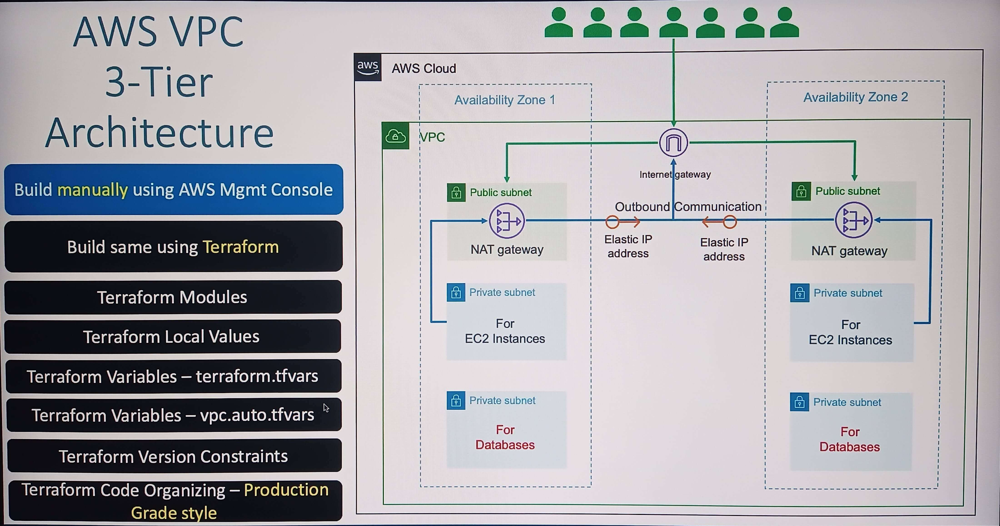

## [<- Geri](../README.md)

#  VPC
- [REPO 06-AWS-VPC/06-02-AWS-VPC-using-Terraform](https://github.com/stacksimplify/terraform-on-aws-ec2/blob/main/06-AWS-VPC/06-02-AWS-VPC-using-Terraform/README.md)
- [vpc module](https://registry.terraform.io/modules/terraform-aws-modules/vpc/aws/latest)
- 

### STEP 2
- Create From AWS Manager (Web)
    - VPC
    - subnet private, subnet public
    - Internet Gateway ans Associate it to VPC
    - Go to Nat Gateways
        - use public-subnet
        - allocate elastic-ip
    - Route table with VPC (my-public-route-table)
        - **ROUTES** 
        - select created route table
        - go routes tab
        - edit routes
        - add route
            - Destination 0.0.0.0/0
            - Target igw (INTERNET GATEWAY NOT NAT GATEWAY)
        - **SUBNET** 
            - Subnet Associations
            - Click `Edit Subnet Associations`
            - select public subnet that we created
    - Route table with VPC (my-private-route-table)
        - **ROUTES** 
        - go routes tab
        - edit routes
        - add route
            - Destination 0.0.0.0/0
            - Target igw (NAT GATEWAY)
        - **SUBNET** 
            - Subnet Associations
            - Click `Edit Subnet Associations`
            - select private subnet that we created
- Nasıl sileriz
    - NAT gatewayi sil. 2-5 dk beklemek gerekiyor.
    - VPC'yi sil
    - TAMAM
### STEP Bilmem kaç
- `v1-vpc-module`'i oluşturduk ve içine gerekli şeyleri doldurduk
- `v2-vpc-module-standardized` v1 ile aynı ama parametrik yapıyor olacağız.
- hadi bakalım, v1'e bakamadan v1 gibi bir tane oluşturmayı deneyelim. `v1-demo` olsun adı :)
    - Bence baya baya yaptık ama bilmediğim flagler var hala. Networkü biraz daha öğrenince oturur diye umuyorum.
    - mesela aşağıdakiler

### v1-demo
- `terraform-aws-modules/vpc/aws` için
    - şunları bilmiyorum
        - create_database_subnet_group = true
        - create_database_subnet_route_table = true
        - enable_dns_hostnames = true
        - enable_dns_support = true
        - enable_nat_gateway = true
        - single_nat_gateway = true
            - Bu galiba bi üstteki ile iyi gidiyor. Bu şekilde 1 tane public ip almış oluyoruz
## Notes
- Nat gateways
    - Public ip veriyor, elastic-ip atadığımız için.
    - İşimizi tamamlayınca bunu kapatın, para yazar :D
- local variables
- **.auto.tfvars yapınca otomatik olarak import ediyormuş
    - mesela, vpc.auto.tfvars
    