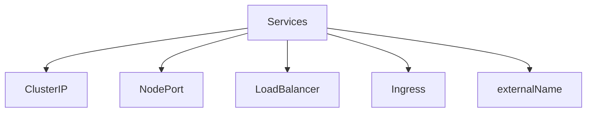
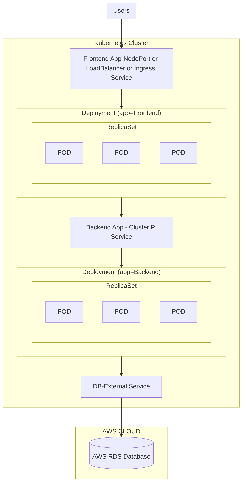

## [<- Geri](../README.md)

# Services

### ClusterIP
- Used for communicaiton between applications inside k8s cluster
- (Example: Frontend application accessing backend application)
- YORUMUM: Açıklama bana saçma geldi. Bence böyle değil. Çoğu zaman 2 applicationı da dışarı açarsın kanki.
### NodePort
- Used for accessing applications outside of k8s cluster using Worker Node Ports
- Example: Accessing Frontend application on browser
### LoadBalancer
- Primarily for cloud providers to integrate with their Load Balancer services
- Example: AWS Elastic Load Balancer
### Ingress
- Advanced load balancer which provides Context path based routing, SSL SSL Redirect and many more
- Exmaple: AWS ALB
### externalName
- To access external hosted apps in k8s cluster
- Example: Access AWS RDS Database endpoint by applciation present inside k8s cluster

